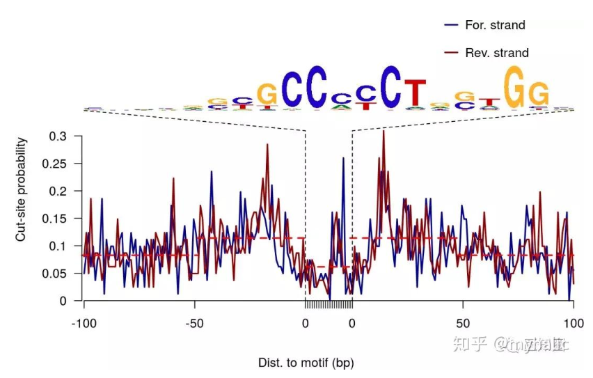

# bulkATAC处理

**05_call_peaks** [macs3]() 找到每个.bam文件里面所有潜在的peaks，找到的peaks保存在.narrowPeak(每个文件大概3.5MB)文件里面
[哈佛大学ChIP/ATAC/CUT&TAG/CUT&RUN教程07: 使用MACS去call peak](https://mp.weixin.qq.com/s/ZxzMC2Hu3wZisHAJ6M3PSQ)
```shell
# 使用samtools查看.bam文件
samtools view /data/input/Files/taoziyi/cotton_atac/NB2025053011270768166314/ATAC-seq/E1-2_bwa_rmdup.bam | head -n 10
head -n 2 /data/work/test0707/05_call_peaks/E1_0_peaks.narrowPeak
# E1_Chr01        23338   23640   E1_0_peak_1     52      .       3.89344 7.48983 5.25374 137
# E1_Chr01        24477   24829   E1_0_peak_2     67      .       4.21456 9.03946 6.70928 273
```
**06_merge_peaks** [IReNA]() 合并.narrowPeak文件为.gtf文件，有69200种Peak
```shell
head -n 2 /data/work/test0707/06_merge_peaks/peaks_merged.gtf
# E1_Chr01        .       exon    23286   23786   .       .       .       gene_id Peak1
# E1_Chr01        .       exon    24387   24887   .       .       .       gene_id Peak2
```

**07_calculate_counts** [htseq-count]() 根据.gtf文件去计算每个.bam中对应类别peak的数量
[从NCBI下载数据后的处理7——HTseq比对，定量，生成count.txt文件](https://mp.weixin.qq.com/s/F1hiYj5X1hStuWEpQdlj7A)
```shell
head -n 3 /data/work/test0629/07_calculate_counts/E1_0_Counts.txt
Peak1   36
Peak10  94
Peak100 15
```

**08_differential_peaks** [IReNA]() 找到存在差异的peak，存在差异的peak更是我们关注的，如果不做这一步的话，理论上会拿到非常多的peak，可能后面找regulatory会很多，没办法锁定更多的peak，但实际情况却是我们找到的potential很少哈哈哈，所有似乎没必要找differential_peak
```shell
head -n 3 /data/work/test0629/08_differential_peaks/differential_peaks.bed
E1_Chr01        23286   23786
E1_Chr01        93192   93692
E1_Chr01        385507  386007
```

**09_merge_bams** [samtools]() 将各个.bam文件合并为一个*_all.bam文件

**10_footprints** [rgt-hint]() 把*peaks.bed对到merged之后的.bam文件上，找到所有区段，并筛选出 V5 列的值大于其第 80 百分位数（80th percentile）的行
> Footprints是什么？ ATAC-seq footprints可以帮助我们查看转录因子在全基因组上结合的状态。ATAC-seq中的足迹是指活性TF与DNA结合，从而阻止Tn5在结合位点切割。所以客观上形成一个被保护的区域，一个低coverage区域
> 

[使用HINT-ATAC进行ATAC-Seq的footprinting分析](https://www.jianshu.com/p/6aba8f1dea56)
[没有最艰难只有更艰难--r.g.t](https://mp.weixin.qq.com/s/pteMGGF1gwWx9bS1gru82w)
[rgt-hint 转录因子预测结果可视化](https://mp.weixin.qq.com/s/RRn1kmJCZoiy6erOOR6gAg)
[rgt-hint 转录因子预测结果可视化(续)](https://mp.weixin.qq.com/s/5ka15kregXe4XDpLyW-Z-w)
```shell
head -n 2 /data/work/test0629/10_footprints/footprints.bed
# E1_Chr01        23291   23319   E1_Chr01:23291-23319    116     .
# E1_Chr01        23337   23372   E1_Chr01:23337-23372    149     .
head -n 2 /data/work/test0629/10_footprints/filtered_footprints.bed
# E1_Chr01        385709  385755  811
# E1_Chr01        385756  385770  810
```